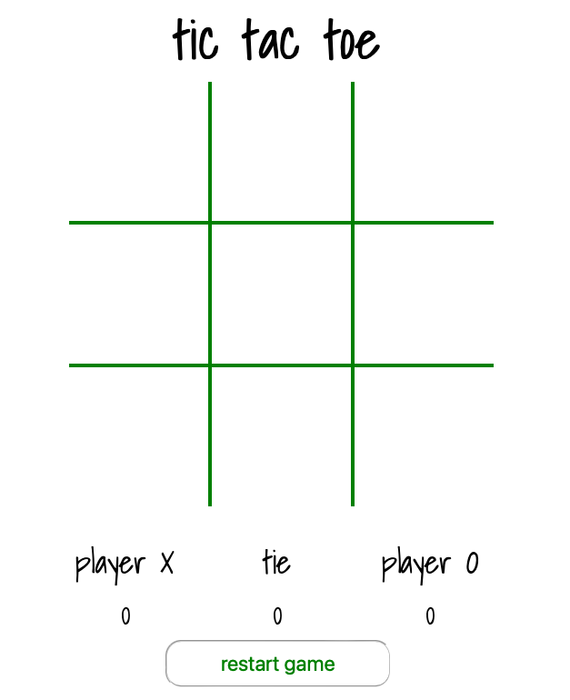

Tic Tac Toe
=====================

Project Description
----------------------

This was my first development.

As a General Assembly student, this project required building this code from scratch, and it was very challenging to put into practice what I had learned so far about HTML, CSS and JS (using jQuery).

In the frame time, I achieved all the project requirements and made a bonus part to keeping track of multiples rounds with a win counter. And also a ***EASTER EGG***, try to find it.

This code there isn't knowing bugs.

Try it on
----------------------

You can access and play this game at this link: [Project 0 - Tic Tac Toe](https://projectzero-tictactoe.netlify.app)

Image
----------------------

Acknowledgment
----------------------

A big thanks to Hugh Sinclair, who helped me make this code more reliable.